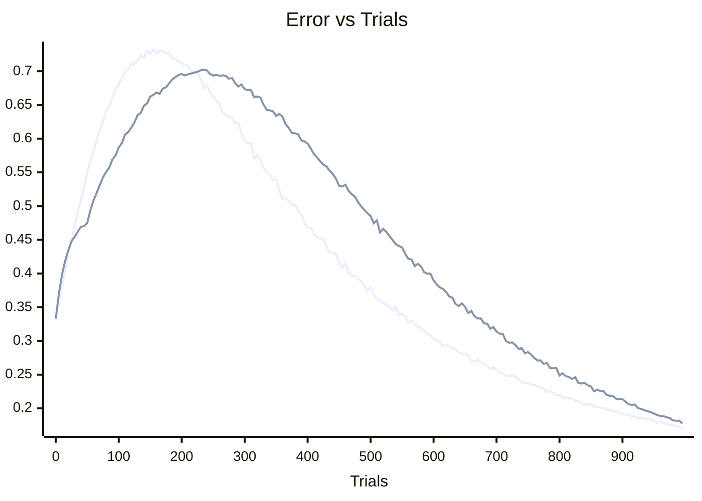
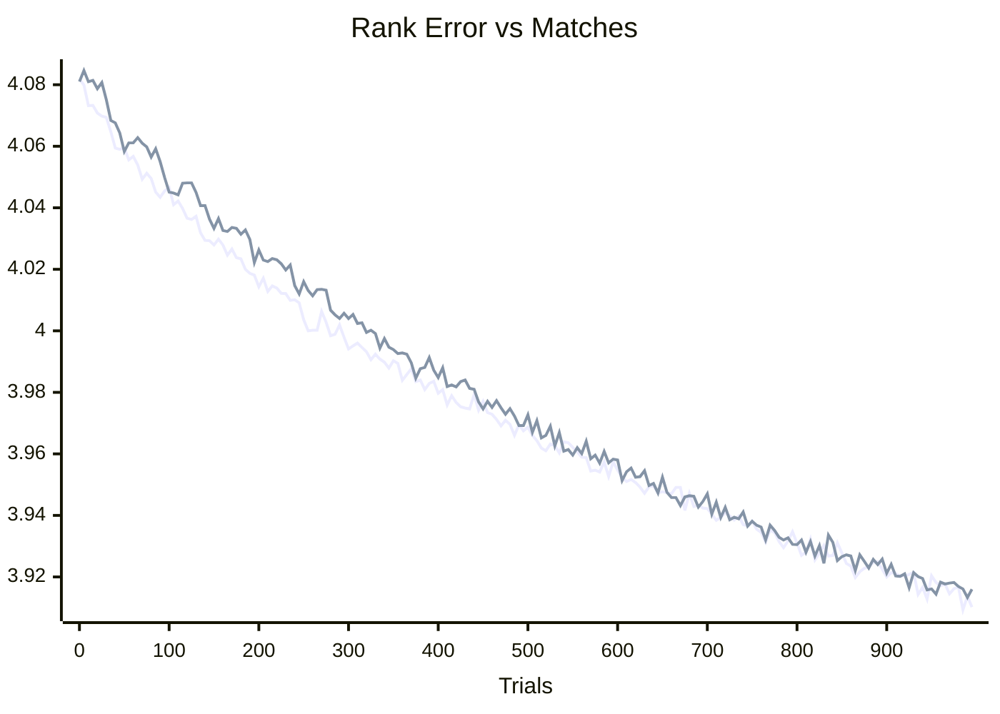
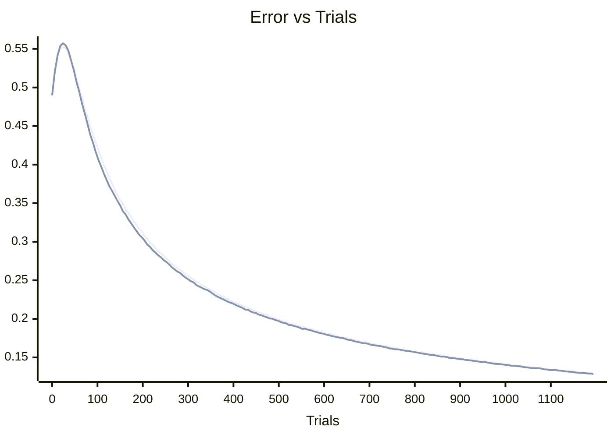
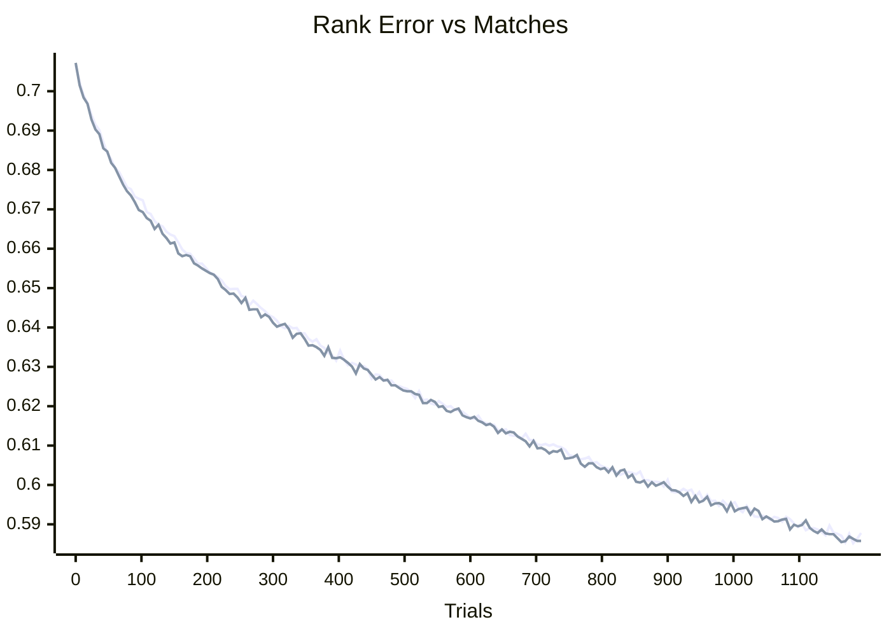
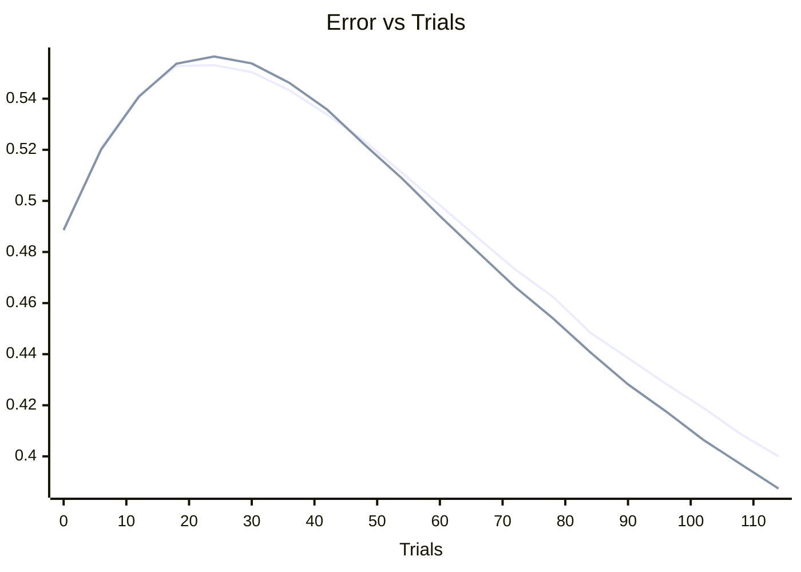
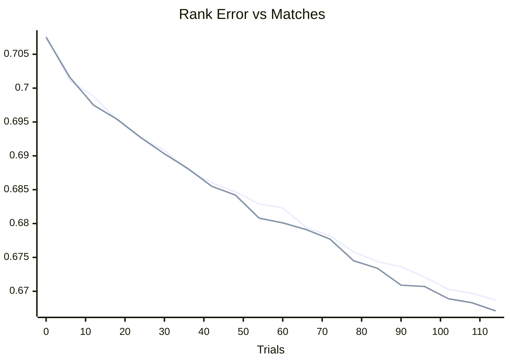

# Bradley-Terry implementation

This is intended to be a simple implementation of the [Bradley-Terry][1] model. Code is written for
easy of readability and verifiability over performance.

Note that this has not been thoroughly tested.

[1]: https://en.wikipedia.org/wiki/Bradley%E2%80%93Terry_model

# Usage
`gsheet-wrapper.ts` is a wrapper function around the library that allows for usage as a Google
Apps Script extension providing the custom formula `BRADLEYTERRY` for usage inside a google
sheet. 

The file is bundled using `esbuild` to `dist/gsheet-wrapper.js`. Simply copy the contents of this
file to Apps Script (Extensions -> Apps Script) to make it available. Then you be able to use the
spreadsheet function  with a table of wins, or a list of pairings. E.g.

|   | A | B |
|---|---|---|
| **1** | Nora | Tollhouse |
| **2** | Tollhouse | Saffitz |
| **3** | Saffitz | Pillsbury |
| **4** | Tollhouse | Pillsbury |
| **5** | Nora | Pillsbury |
| **6** | Nora | Saffitz |
| **7** | Saffitz | Tollhouse |
| **8** | Tollhouse | Saffitz |
`=BRADLEYTERRY(A:B)`

or a table of wins

|   | A | B | C | D | E |
|---|---|---|---|---|---|
| **1** | | Nora | Tollhouse | Saffitz | Pillsbury |
| **2** | Nora | 0 | 1 | 1 | 1 |
| **3** | Tollhouse | 0 | 0 | 2 | 1 |
| **4** | Saffitz | 0 | 1 | 0 | 1 |
| **5** | Pillsbury | 0 | 0 | 0 | 0 |
`=BRADLEYTERRY(A1:E5)`

@TODO - For example usage see [this google sheet][1]

[1]: https://example.com

# Sources
I am following the details from [Newman - Efficient computation of rankings from pairwise comparisons][2]
as I found it the most straightforward and readable method while still being efficient. Also worth 
noting is [MM algorithms for generalized Bradley-Terry models][3] which has a very similar method
that I assume converges faster. The current (Feb 2026) wikipedia page for Bradley-terry mixes
these two algorithms in the Inference/Worked example section leading to confusion. The example table
is also not a strongly connected graph, and this fact is not accounted for leading to erroneous
results.

From formula 26 in the Newman paper

$`\pi'_i = \frac{1/(\pi_i + 1) + \sum_j w_{ij} \pi_j / (\pi_i + \pi_j)}{1/(\pi_i + 1) + \sum_j w_{ji} / (\pi_i + \pi_j)}`$

This is a modification to formula 12 which handles non-strongly connected graphs.

Quotes from paper section 5.

> ...the likelihood of a Bradley-Terry model in which we have added two fictitious games for each 
> player, one won and one lost
> 
> It also removes the invariance under multiplication of the πi by a constant and hence eliminates 
> the need to normalize them.
> 
> This is the generalization of Eq. (12) to the MAP case. It is completely equivalent to adding the 
> fictitious games and has the same guaranteed convergence.

[2]: https://arxiv.org/abs/2207.00076
[3]: https://www.jstor.org/stable/3448514

---

@ TODO - Graph y = chance of ranking strongest competitor #1, x = number of matches
@ TODO - Graph y = squared error for strength accuracy, x = number of matches

# Development

## Error graphs from simulation

# To Do
## Compare with voiting systems
[Voting with partial orders][4] looked like it should be a good place to start

[4]: https://scholarship.claremont.edu/cgi/viewcontent.cgi?article=1273&context=hmc_theses
    
## Testing
 - Write tests that generate data and run the model against it.
 - Give some performance results
 - Find an external source of data to verify against

## API
 - Create an API class for processing input data into the format for the model

## Extension
 - Look at the method for extending the model to handle ties as described in the Newman paper
 - Look into how to get an estimation of uncertainty based on data size, matchups etc.

## Answer questions such as
 - Assume Eve knows the actual strength of players, the current scores, and can decide the next
matchup. How can we handle her favoring a single player by matching them against overrated players?
or other strategies?

- What other issues could arise from a malicious actor? Tournament design etc.

- What about malicious voters? If Eve can decide a single matchup, and knows the computed values as
well as actual strength how can she maximize the impact to favor her chosen player?
